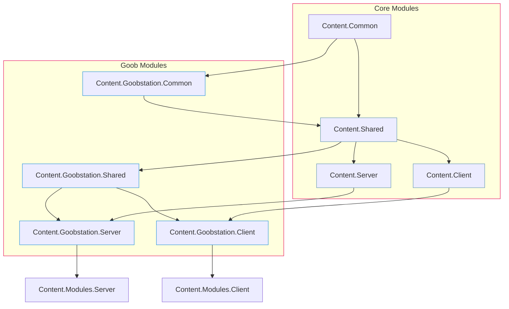
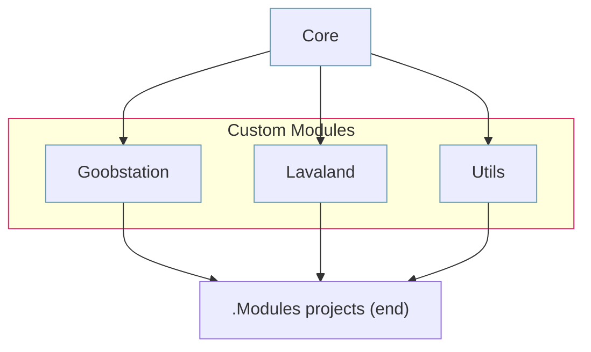
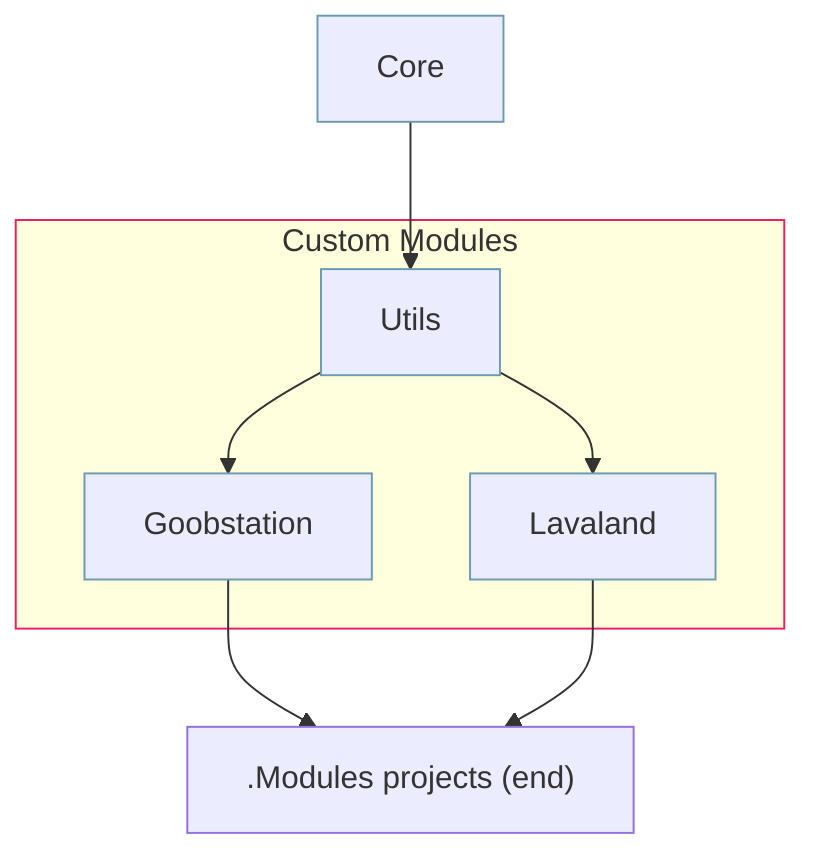

# Reforged Modules

Goobstation provides a way to isolate your code into separate, custom modules. These custom modules retain full functionality like the core modules, while solving the problem of having to recompile the entire game when making changes specific to your downstream.

## Why

As stated above, there are two primary reasons:

1. **Streamlined Testing and Deployment**: By separating downstream-specific code from the rest of the game, you can compile and test your custom features independently.

2. **Enhanced Modularity**: Instead of managing files and folders within the already bloated Content.Client/Shared/Server projects, you can organize your work into four distinct, fork-specific projects.

This approach is specifically designed to accommodate [Robust Modularity](https://github.com/space-wizards/docs/pull/152) should it be implemented in the future.

## Creating new modules

Goob Reforged repository has a script to automatically create a module and connect it to the game in `/Tools/create_module.py`. Launch it through a command line, specify the name, and you have your module set up and ready!

## Terminology

- **Core Module**: Modules belonging to the base space-station-14 repository. These include `Content.Client`, `Content.Server`, `Content.Shared`, their dependencies like `Content.Shared.Database`, and `Content.Common`.

- **Custom Module**: Modules that are part of the Client or Server process but don't belong to Core Modules. They are located in the `/Modules/` folder and have an infix.

- **Engine Module**: Modules that are part of RobustToolbox (the game engine). These are prefixed with `Robust.`.

- **.Common**: A module type intended to be shared between Custom and Core modules. These hold interfaces, components, and other types that both module types need to share. `Content.Common` is located on top of all other `.Common` modules.

- **Infix**: The module identifier, which is the middle part of a module name. For example, "Goobstation" in `Content.Goobstation.Common`.

- **Postfix**: The special module identifier, which specifies its special role, for example `.Database`. Read [Special module projects](#special-module-projects) for more details.

## How

### Module manager

The client loader, unless configured otherwise, loads every Assembly from the `Assemblies` folder with a specific prefix.
This prefix can be defined in the `manifest.yml` file and defaults to `Content.`.

By creating new projects with the `Content.` prefix, you can have the game automatically load them at startup alongside the core modules.

### Dependency tree

Here's an example of the module dependency tree for Goobstation modules:

This means:
- Custom modules directly reference their core module counterparts.
- Core modules cannot directly access code from Custom modules if they are of the same type (Core.Shared-Custom.Shared), as this would create a circular dependency.
- If the types are the same, core modules must communicate with Custom modules through an intermediary `.Common` module using events.
- The Common module must Not depend on either core or Custom modules and should be able to build standalone.

### Module compilation

However, the module loader does not ensure that the modules actually compile in the right order.

By default, when a project is run, MSBuild will compile all references of that project first, and then run it. The issue is that custom modules depend on the core modules, so they don't compile automatically by default!

In order to fix this, each Core project should have a special .csproj `Target` that waits until the project is fully compiled, and then compiles all custom modules connected to this core module. After that the results are copied into the bin folder where all other assemblies are located.

### Up-to-date compilation problem

Unfortunately, the method of Module Compilation described above doesn't solve the issue entirely. When no changes are made to any files in the core module, the .csproj `Target` doesn't trigger, and modules are ignored even if they have some changes.

Because of that, when you make changes to modules and not to the core projects, you have to compile the whole solution so the changes are applied correctly. This is done automatically if you launch from an IDE.

## Module organization

Modules are highly recommended to be independent of other modules. This means that each module references only the core and nothing else.

Here's a chart to represent this structure:

The only exception for that convention are **library modules** that provide some general tools or API for other modules to use.

Those may be required if there are multiple modules that use same features.

For example, lets assume that both `Lavaland` and `Goobstation` modules need to use code from `Utils`.

Then it's okay to change the project structure like this:

## Special module projects

In `Goobstation` module folder, you can find some projects with weird Postfixes, such as `Content.Goobstation.Client.UIKit`, `Content.Goobstation.Server.Database`. Those are projects that have a unique role in code. Each of them has to be explained separately.

- `.Server.Database` - a project that specifies a single Database model. At the moment Goob Reforged uses the core model and the Goob model for proper modularity.
- `.Client.UIKit` - a project that references `Robust.Client` and `Content.Shared`, and which is referenced directly by `Content.Client`. Contains custom UI elements that have to be usable in `Content.Client`, without making changes to it directly.

### Content.Common

`Common` modules sometimes need to use some of the game's code, for example to inherit an interface for a type or to use a general data structure.

Those are usually located at `Content.Shared`, and are inaccessible for Common modules. That's why `Content.Common` exists - it allows to use the code ported from `Content.Shared` in all `Content.*.Common` custom modules.

The files from `Content.Shared` are moved into `Content.Common` without changing the namespace. This is needed so no `using`s in the code of Core modules have to be changed. And even though it shows as a `Content.Shared.*` namespace, it's actually also available from `Content.*.Common` custom modules!
